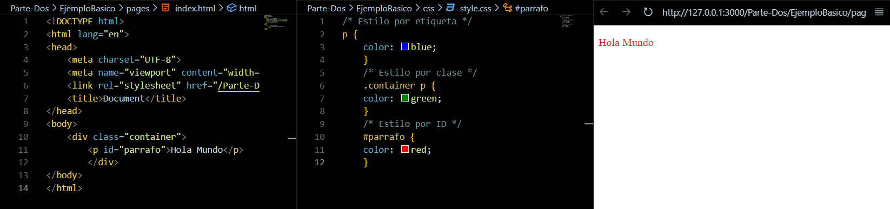
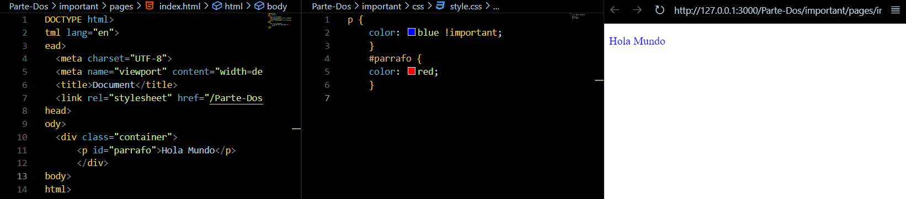
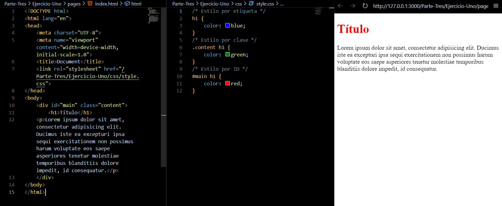
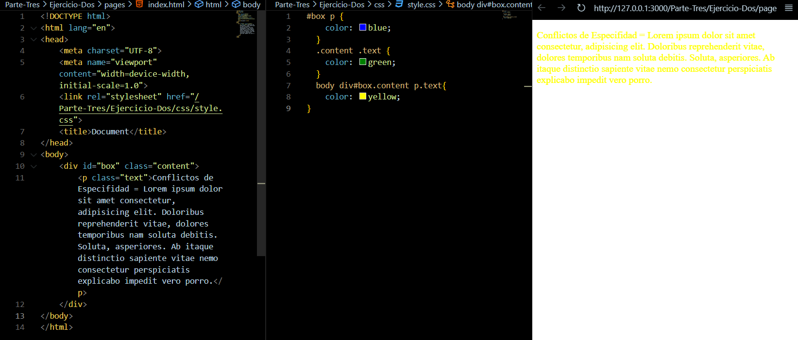
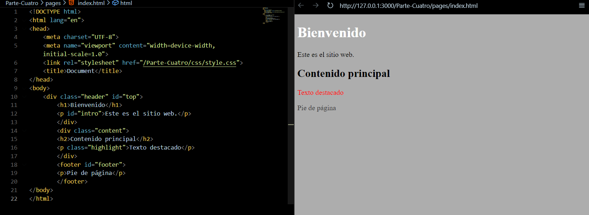

# Taller_Especifidad_GalanFabian
README con la solución del taller. Especificando Nro Parte. Enunciado, Solucion y ScreenShoot de la ejecucion
# Diapositivas 
Puedes ver la presentación completa aquí: [Especifidad.pdf](Especifidad.pdf)
# Parte 1: Introducción Teórica a la Especificidad
A: La especificidad en CSS determina qué tan relevante es una regla CSS específica para un elemento particular. Cuando el navegador encuentra varios estilos que pueden aplicarse a un elemento, verifica la especificidad de cada regla y aplica la más específica. Los selectores son:

   1. Selectores de ID: Valor de especificidad de 100 puntos.
   2. Selectores de clase, pseudoclases y atributos: Valor de especificidad de 10 puntos.
   3. Selectores de elementos y pseudoelementos: Valor de especificidad de 1 punto.

| Selector                            | Ejemplo                     | Especificidad Calculada |
|-------------------------------------|-----------------------------|-------------------------|
| **Selector universal**              | `*`                         | 0                       |
| **Selector de elemento**            | `p`                         | 1                       |
| **Selector de pseudoelemento**      | `p::before`                 | 1                       |
| **Selector de clase**               | `.mi-clase`                 | 10                      |
| **Selector de atributo**            | `[type="text"]`             | 10                      |
| **Selector de pseudoclase**         | `:hover`                    | 10                      |
| **Selector de ID**                  | `#mi-id`                    | 100                     |
| **Selector en línea (style)**       | `style="color: red;"`       | 1,000                   |
| **Selector `!important`**           | `color: red !important;`    | N/A*      

# Parte 2: Ejemplos Prácticos

Demuestra cómo los diferentes selectores afectan la especificidad.

El resultado esperado de esta versión del código es el de mostrar el texto dentro de la etiqueta en color rojo, esto debido a que el selector id = "parrafo" es el que tiene un mayor valor de especificidad (100 puntos).

El resultado esperado en esta version del codigo es el de mostrar el texto dento de la etiqueta en color azul, esto debido a que se le agrego el marcador !important dentro de los estilos definidos para la etiqueta en el archivo CSS (Forzando el uso de este estilo).

# Parte 3: Ejercicios Prácticos
Ejercicio 1: Calculando la Especificidad

Pregunta: ¿Qué color tendrá el título?

El título tendría color rojo, ya que el estilo aplicado con mayor especificidad es el id estiloMain con el elemento, el cual tiene un valor de especificidad de 101, y se le aplica el estilo de color de letra rojo.

Ejercicio 2: Resolviendo Conflictos de Especificidad

Solucion (Selector de mayor especifidad):
    1. body
    2. div
    3. id
    4. class
    5. p
    6. class
# Parte 4: Desafío Final 
Desafío: Diseñando una Página Completa con Estilos Conflictivos

